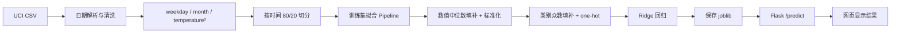

# RideCast 课堂 PRE：共享单车需求估计器

> **展示时长：5 分钟展示 + 2 分钟问答**
> **建议方式：** 按下面的“页面顺序”制作 PPT；“讲稿”部分可以直接照读。现场演示使用 Render 线上地址，避免临时安装环境。

## 一、展示目标与一句话介绍

### 项目一句话

RideCast 根据日期、小时、天气和系统运行状态，预测首尔共享单车某一小时的租借量，并把训练、评估和在线预测串成一个可复现的网页应用。

### 评分点对应关系

| 作业要求 | 本项目对应内容 |
|---|---|
| 问题与数据 | UCI Seoul Bike Sharing Demand，8,760 条逐小时记录 |
| 训练模型 | 时间顺序 80/20 切分，Ridge 回归，加入 `temperature²` |
| 模型评价 | 测试集 MAE、R²、实际值—预测值散点图、最大误差样本 |
| 模型解释 | Pipeline 预处理、系数解释、误差原因和适用范围 |
| 后端调用 | Flask `/predict`，启动时加载保存的 joblib Pipeline |
| 前端交互 | 输入范围校验、单位说明、预测结果和错误提示 |

---

## 二、5 分钟页面顺序与逐段讲稿

### 第 1 页｜问题与产品（约 20 秒）

**页面内容：** 项目名称、网页截图、输入和输出示意。

**讲稿：**

> 我们做的是共享单车需求估计器。用户输入日期、小时、温度、湿度、降雨、降雪、是否节假日和系统是否运行，网页返回预计租借量，单位是辆/小时。这个项目的重点不是只训练一个模型，而是把数据处理、模型评价和后端预测做成同一条可复现流程。

**现场打开：** [Render 全栈应用](https://ridecast-ml-homework-1.onrender.com)

---

### 第 2 页｜数据与任务定义（约 45 秒）

**页面内容：** 数据表字段、目标列、单位和时间切分示意。

**讲稿：**

> 数据来自 UCI 的 Seoul Bike Sharing Demand 数据集，共 8,760 条逐小时记录，覆盖 2017 年 12 月到 2018 年 11 月。预测目标是 `Rented Bike Count`，也就是每小时租借量。
>
> 网页可以获得的输入分为三类：第一类是时间，包括日期和小时；第二类是天气，包括温度、湿度、降雨量和降雪量；第三类是运营状态，包括是否节假日和系统是否运行。星期和月份从日期派生，另外增加温度平方项，表示温度和需求之间可能存在弯曲关系。
>
> 训练集按时间顺序取前 80%，共 7,008 条；测试集取后 20%，共 1,752 条。这样测试集模拟未来数据，避免随机切分把未来分布混入训练过程。

**数据说明：** [`data/README.md`](data/README.md)

---

### 第 3 页｜训练与预测流程（约 70 秒）

**页面内容：** 下面的流程图。



**讲稿：**

> 数据先解析日期并检查字段。训练集内拟合一条 Pipeline：数值变量用训练集的中位数填补，再标准化；类别变量用训练集众数填补，再做 one-hot 编码；最后使用 Ridge 回归。
>
> 所有填补、标准化和编码参数只从训练集学习。测试集和网页请求不会重新拟合这些参数，而是直接复用保存的 Pipeline。这一点可以保证离线评估和线上预测使用完全相同的特征处理。
>
> 我们选择 Ridge 是因为它保留了线性模型的可解释性，同时通过正则化减小 one-hot 特征和相关数值特征带来的系数不稳定。温度平方项让模型能表达简单的非线性。

**模型形式：**

\[
\hat y = \beta_0 + \beta_1 x_1 + \cdots + \beta_p x_p
\]

其中数值特征在进入 Ridge 前已标准化，类别特征已转换为 0/1 指示变量。

#### 第 3 页原理补充：方法、损失函数与代码函数（建议讲 40–50 秒，包含在本页时间内）

**1. 这是监督学习中的回归问题**

每条训练记录都有输入特征 `x` 和已知租借量 `y`，模型学习从 `x` 到连续数值 `y` 的映射。因为目标不是类别标签，所以使用回归模型和 MAE、R²，而不是分类准确率、Precision、Recall 或混淆矩阵。

**2. Ridge 优化的目标函数**

令 `n` 为训练样本数，`X` 为经过 Pipeline 处理后的特征矩阵，`w` 为回归系数，`b` 为截距。Ridge 最小化：

\[
\mathcal{L}(w,b)=\frac{1}{2n}\lVert y-Xw-b\mathbf{1}\rVert_2^2+\alpha\lVert w\rVert_2^2
\]

- 第一项是 **均方误差型平方损失**：预测偏差越大，惩罚按平方增长；
- 第二项是 **L2 正则化项**：惩罚过大的系数，降低过拟合和共线性带来的不稳定；
- 本项目使用 `Ridge(alpha=10.0)`；截距用于整体平均水平，正则化主要约束系数 `w`。

使用梯度下降来理解时，系数部分的梯度为：

\[
\frac{\partial\mathcal{L}}{\partial w}
=-\frac{1}{n}X^T(y-Xw-b\mathbf{1})+2\alpha w
\]

实际的 `scikit-learn` 会选择适合数据规模的数值求解器；这里的公式用于解释“平方损失把预测拉向真实值，L2 项把系数拉向 0”。

**3. 训练损失和报告指标不是一回事**

Ridge 训练优化的是“平方损失 + L2 正则化”，但报告时使用 MAE 和 R²：

\[
MAE=\frac{1}{n}\sum_{i=1}^{n}|y_i-\hat y_i|
\]

\[
R^2=1-\frac{\sum_i(y_i-\hat y_i)^2}{\sum_i(y_i-\bar y)^2}
\]

MAE 与业务单位相同，容易解释平均相差多少辆；R² 衡量模型相对于“直接预测测试集均值”的改进程度。两者都在未参与拟合的时间后 20% 测试集上计算。

**4. 代码中的关键函数**

| 原理步骤 | 代码函数/对象 | 作用 |
|---|---|---|
| 日期解析 | `pd.to_datetime` | 把日期字符串变成可提取月份和星期的时间对象 |
| 缺失填补 | `SimpleImputer` | 数值用中位数、类别用众数，只在训练集拟合 |
| 数值标准化 | `StandardScaler` | 使用 `z=(x-μ)/σ`，让不同量纲的数值进入同一尺度 |
| 类别编码 | `OneHotEncoder` | 把 `Holiday`、星期等类别转换为 0/1 特征 |
| 流程封装 | `Pipeline`、`ColumnTransformer` | 保证训练、测试和网页输入采用同一处理顺序 |
| 模型训练 | `Ridge.fit(X_train, y_train)` | 学习系数和截距 |
| 模型预测 | `Ridge.predict(X)` | 输出连续租借量；代码再用 `np.maximum(0, prediction)` 保证不出现负数 |
| 指标计算 | `mean_absolute_error`、`r2_score` | 计算测试集 MAE 和 R² |
| 模型保存 | `joblib.dump` / `joblib.load` | 保存并重新加载完整 Pipeline |

**讲解温度二次项时要强调：** `temperature²` 让输入空间出现曲线关系，但模型对参数 `w` 仍然是线性的，所以它仍属于线性回归家族，而不是神经网络或黑盒模型。

---

### 第 4 页｜测试集结果与误差（约 55 秒）

**页面内容：** 指标表 + [`reports/actual_vs_predicted.png`](reports/actual_vs_predicted.png)。

| 模型 | MAE（辆/小时） | R² |
|---|---:|---:|
| 不含温度二次项的线性基线 | 303.20 | 0.474 |
| RideCast Ridge + `temperature²` | **292.86** | **0.509** |

**讲稿：**

> 测试集 MAE 是 292.86 辆/小时，R² 是 0.509。相比不含温度二次项的基线，MAE 下降约 10.34 辆/小时，R² 提升约 0.035，说明温度二次项带来了一定改善。
>
> 散点图中，点越接近对角虚线，预测越接近实际值。模型对一般时段有一定解释能力，但高峰时段仍可能低估。
>
> 最大误差样本是 2018 年 10 月 1 日 18:00：实际租借量 2,857，预测约 1,010，绝对误差约 1,847。这个样本温度 16.6°C、湿度 61%、无雨雪且系统正常运行，说明只使用当前时间和天气变量，仍无法解释活动、库存或交通状态造成的异常高需求。

**证据文件：**

- [`reports/model_metrics.json`](reports/model_metrics.json)
- [`reports/largest_error.json`](reports/largest_error.json)
- [`reports/test_predictions.csv`](reports/test_predictions.csv)

---

### 第 5 页｜模型解释（约 50 秒）

**页面内容：** 系数条形图或 [`reports/coefficients.csv`](reports/coefficients.csv) 的前几项。

**讲稿：**

> 这里要注意，数值特征经过了标准化，所以数值系数表示“该特征增加一个训练集标准差时，预测租借量的平均变化”，不是原始单位增加 1 时的变化。类别系数表示相对被省略的基准类别差异。
>
> `functioning_day_Yes` 系数约为 +764.69，说明系统运行日和不运行日之间存在很大的平均差异，这是符合业务含义的。
>
> 标准化后的温度系数约为 +456.97，温度平方项约为 −79.20，表示在模型范围内，温度升高总体会提高需求，但边际作用会减弱。湿度系数约为 −130.09，说明较高湿度与较低租借需求相关。
>
> 这些系数是模型中的相关关系和条件解释，不能直接当作因果结论。

**严格表述：** 不要说“温度每升高 1°C 就增加 456 辆”；应该说“温度增加一个训练集标准差时，模型预测平均增加约 457 辆，其他变量保持不变”。

---

### 第 6 页｜网页和后端演示（约 55 秒）

**页面内容：** 网页输入区、结果区、API 请求示意。

**现场演示顺序：**

1. 打开 [Render 线上应用](https://ridecast-ml-homework-1.onrender.com)；
2. 使用默认示例：
   - 日期：2026-09-22；
   - 小时：17:00；
   - 温度：18°C；
   - 湿度：55%；
   - 降雨、降雪：0；
   - 非节假日、系统运行；
3. 点击“估计租借需求”；
4. 展示约 **1,095 辆/小时** 的真实后端结果；
5. 可额外把湿度改为 101 或清空温度，展示前端错误提示。

**讲稿：**

> 网页通过 `POST /predict` 发送原始输入，Flask 后端重新校验范围，日期派生星期和月份，然后调用启动时加载的 joblib Pipeline。当前示例返回约 1,095 辆/小时。输入缺失或越界时，前端和后端都会给出提示；模型文件缺失时，后端会返回 503，而不是静默生成一个假结果。

**API 示例：**

```http
POST https://ridecast-ml-homework-1.onrender.com/predict
Content-Type: application/json
```

```json
{
  "date": "2026-09-22",
  "hour": 17,
  "temperature": 18,
  "humidity": 55,
  "rainfall": 0,
  "snowfall": 0,
  "holiday": "No Holiday",
  "functioning_day": "Yes"
}
```

返回：

```json
{"prediction": 1095}
```

---

### 第 7 页｜局限、结论与下一步（约 30 秒）

**页面内容：** 三条局限 + 一条下一步。

**讲稿：**

> 最后总结三点：第一，按时间切分后，当前模型在测试集上达到 MAE 292.86、R² 0.509；第二，保存完整 Pipeline 并通过 Flask 调用，保证了训练和预测的一致性；第三，模型仍受数据范围限制。
>
> 局限包括：数据只来自首尔；没有大型活动、道路施工、库存和公共交通故障；极端天气属于外推。下一步可以加入风速、能见度、季节、滚动历史需求，并在训练集内部用交叉验证比较随机森林或梯度提升模型。

---

## 三、现场演示备用方案

如果 Render 免费实例正在休眠，按以下顺序处理：

1. 等待页面完成唤醒，再点击一次提交；
2. 打开 `/health`，确认返回 `{"model_loaded":true,"status":"ok"}`；
3. 若网络不稳定，切换到本地运行：

```powershell
python -m backend.train_model
python -m backend.app
```

然后访问 <http://127.0.0.1:5000/>。

如果课堂只需要展示界面，可以打开 [GitHub Pages 静态预览](https://ouy5517.github.io/ML_homework_1/)，但要明确说明页面此时使用的是前端演示估计，不是 Flask 模型结果。

---

## 四、2 分钟问答备稿

### 问：为什么按时间顺序切分，而不是随机切分？

答：实际任务是用过去预测未来。时间顺序切分能模拟上线场景，也避免未来记录的信息进入训练集。随机切分可能让训练集和测试集共享相近时间段，指标会偏乐观。

### 问：为什么使用 MAE 和 R²？

答：MAE 与目标同单位，能直接解释平均相差多少辆/小时；R²反映模型解释测试集波动的程度。两者结合可以同时说明误差大小和拟合能力。

### 问：为什么用 Ridge，而不是直接用普通线性回归？

答：one-hot 后特征数量增加，且时间、温度及温度平方项可能相关。Ridge 加入 L2 正则化，能减小系数波动，同时保留线性模型的可解释性。

### 问：Ridge 的损失函数是什么？为什么不是直接最小化 MAE？

答：Ridge 最小化的是均方误差型平方损失加 L2 正则化：`1/(2n)||y-Xw-b||² + α||w||²`。平方损失对大误差更敏感，适合用来拟合连续租借量；MAE 是我们在测试集上报告的业务指标，不是本项目训练时直接优化的目标。

### 问：标准化会不会改变模型含义？

答：标准化不改变每条记录的相对顺序，但会把不同单位转换到相近尺度，避免温度、湿度和小时的数值大小影响正则化强度。标准化后，数值系数应解释为“增加一个标准差的影响”；网页输入仍使用原始单位，Pipeline 会自动完成同样的转换。

### 问：加入 `temperature²` 后还算线性回归吗？

答：算。它对输入变量是非线性的，但对待学习的系数仍是线性的：模型仍然是特征的加权和，只是特征集合里增加了 `temperature²`。

### 问：温度二次项真的改善了吗？

答：在同一时间顺序测试集上，MAE 从 303.20 降到 292.86，R² 从 0.474 升到 0.509，因此本次实验中有改善。但这只是一次固定切分的比较，不能据此声称普遍优于所有模型。

### 问：为什么最大误差这么大？

答：2018-10-01 18:00 的实际租借量是 2,857，预测约 1,010。当前输入没有活动、库存、站点分布和交通状态，因此模型只能根据常规时间和天气关系估计，无法识别异常高峰。

### 问：如何避免训练和网页预测不一致？

答：把缺失填补、标准化、one-hot 和 Ridge 放进同一个 Pipeline，保存为 `models/ridecast_pipeline.joblib`。Flask 启动时加载这个文件，网页只提交原始字段。

### 问：这个预测能直接用于运营调度吗？

答：目前不建议。它适合课堂演示和相近条件下的小时级估计。要用于运营，还需要更多实时特征、滚动验证、异常监测和不同城市的重新训练。

---

## 五、展示前检查清单

- [ ] Render 首页能打开，首次唤醒后等待完成；
- [ ] `/health` 返回 `model_loaded: true`；
- [ ] 默认示例返回约 1,095 辆/小时；
- [ ] 能指出目标、单位、输入特征和 80/20 时间切分；
- [ ] 能解释 MAE、R² 和最大误差样本；
- [ ] 能说明标准化系数不能直接解释成“每 1°C”；
- [ ] 能展示前端错误提示或后端 `/predict` 请求；
- [ ] PPT 中放入实际值—预测值散点图；
- [ ] 每位成员都能讲清楚训练与预测流程。
