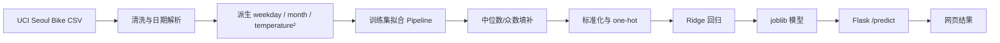

# RideCast：共享单车需求估计器

RideCast 是机器学习课程作业一的可运行项目。用户输入日期、小时和天气条件，网页调用 Flask 后端，返回首尔共享单车每小时预计租借量（辆/小时）。训练和网页预测共用一条保存下来的 `scikit-learn Pipeline`，避免两端的特征处理不一致。

## 在线地址

| 用途 | 地址 |
|---|---|
| Flask 全栈应用（真实模型预测） | [ridecast-ml-homework-1.onrender.com](https://ridecast-ml-homework-1.onrender.com) |
| GitHub Pages 静态预览 | [ouy5517.github.io/ML_homework_1](https://ouy5517.github.io/ML_homework_1/) |
| GitHub 仓库 | [github.com/Ouy5517/ML_homework_1](https://github.com/Ouy5517/ML_homework_1) |
| Render 控制台 | [服务面板](https://dashboard.render.com/web/srv-dasepe60tbcc73f3mlg0) |

Render 服务当前跟踪 `main` 分支并自动部署。免费实例闲置后可能休眠，第一次访问需要等待唤醒。GitHub Pages 只能托管静态文件，后端不可用时会显示“前端演示估计”；要验证真实模型，请访问 Render 地址。

## 快速开始

### 本地运行完整应用

```powershell
python -m venv .venv
.\.venv\Scripts\Activate.ps1
python -m pip install -r requirements.txt
python -m backend.train_model
python -m backend.app
```

打开 <http://127.0.0.1:5000/>。

### 只运行静态前端

```powershell
python -m http.server 8765
```

打开 <http://127.0.0.1:8765/>。未启动 Flask 时，页面会使用演示估计值，不代表训练模型结果。

## 项目流程



## 数据与特征

数据集为 UCI [Seoul Bike Sharing Demand](https://archive.ics.uci.edu/dataset/560/seoul+bike+sharing+demand)，包含 8,760 条逐小时记录。数据获取方式、字段单位和清洗规则见 [`data/README.md`](data/README.md)。训练脚本会在本地缺少 CSV 时自动下载官方压缩包。

预测目标：`Rented Bike Count`，单位为辆/小时。

输入特征：

- 时间：`date`、`hour`，以及由日期派生的 `weekday` 和 `month`；
- 天气：`temperature`（°C）、`humidity`（%）、`rainfall`（mm）、`snowfall`（cm）；
- 状态：`holiday`、`functioning_day`；
- 派生项：`temperature²`，用于表达温度与需求之间的非线性。

训练集按时间顺序取前 80%，测试集取后 20%，避免未来记录泄漏到训练过程。数值字段用训练集的中位数填补并标准化，类别字段用训练集众数填补后做 one-hot；所有变换只在训练集拟合。

## 训练与评估

```powershell
python -m backend.train_model
```

训练完成后会生成：

- `models/ridecast_pipeline.joblib`：预处理和 Ridge 回归组成的完整 Pipeline；
- `reports/model_metrics.json`：测试集 MAE、R² 和不含温度二次项的基线；
- `reports/coefficients.csv`：模型系数；
- `reports/test_predictions.csv`：测试集真实值、预测值和误差分析数据；
- `reports/largest_error.json`：绝对误差最大的测试样本；
- `reports/actual_vs_predicted.png`：实际值—预测值散点图。

当前训练结果：

| 模型 | MAE（辆/小时） | R² |
|---|---:|---:|
| 不含温度二次项的线性基线 | 303.20 | 0.474 |
| RideCast Ridge + `temperature²` | **292.86** | **0.509** |

## API

### 健康检查

```http
GET /health
```

模型已加载时返回：

```json
{"model_loaded": true, "status": "ok"}
```

### 预测

```http
POST /predict
Content-Type: application/json
```

请求示例：

```json
{
  "date": "2026-09-22",
  "hour": 17,
  "temperature": 18,
  "humidity": 55,
  "rainfall": 0,
  "snowfall": 0,
  "holiday": "No Holiday",
  "functioning_day": "Yes"
}
```

成功返回：

```json
{"prediction": 1095}
```

PowerShell 调用线上接口：

```powershell
$body = @{
  date = "2026-09-22"; hour = 17; temperature = 18; humidity = 55
  rainfall = 0; snowfall = 0; holiday = "No Holiday"; functioning_day = "Yes"
} | ConvertTo-Json

Invoke-RestMethod `
  -Uri "https://ridecast-ml-homework-1.onrender.com/predict" `
  -Method Post -ContentType "application/json" -Body $body
```

缺少模型、缺少字段或输入超出范围时，后端会返回明确的错误状态和 `error` 字段。前端也会先做输入校验。

## Render 部署

仓库根目录的 [`render.yaml`](render.yaml) 保存了可复用的 Blueprint 配置：

- Python Web Service；
- 构建命令：`pip install -r requirements.txt && python -m backend.train_model`；
- 启动命令：`gunicorn backend.app:app --bind 0.0.0.0:$PORT --workers 1 --threads 2`；
- `main` 分支自动部署；
- Python 版本固定为 3.12.8。

重新部署时，确保改动已推送到 `main`：

```powershell
git add .
git commit -m "update ridecast"
git push origin main
```

## 项目结构

```text
backend/
  model.py          数据清洗、特征构造、Pipeline、评估与保存
  train_model.py    下载数据、训练模型、生成指标和图表
  app.py            Flask /predict 与 /health 接口
data/
  README.md         数据来源、字段、单位与清洗规则
models/              训练后的 Pipeline
reports/             指标、系数、测试预测和散点图
index.html           前端表单与结果面板
app.js               表单校验、请求 /predict、结果动画
styles.css           页面样式
PRESENTATION.md      课堂 5 分钟展示提纲和讲稿
requirements.txt     Python 依赖
render.yaml          Render Web Service 配置
```

## 测试

```powershell
python -m pytest -q
python -m compileall -q backend
node --check app.js
```

测试覆盖网页关键元素、无障碍错误提示、动效降级、空值校验、特征派生、训练/预测特征一致性、模型缺失状态和 `/predict` 响应。

## 适用范围与局限

模型学习的是首尔历史运营条件，适合课堂演示和相近条件下的小时级估计，不能直接代表其他城市、新站点或长期变化后的需求。大型活动、道路施工、站点库存、公共交通故障等变量没有纳入；极端天气属于训练范围外的外推。当前预测值用于估计，不应直接作为运营承诺。

## 课堂展示

课堂 5 分钟展示提纲、模型公式、指标、系数解释和可能提问见 [`PRESENTATION.md`](PRESENTATION.md)。
